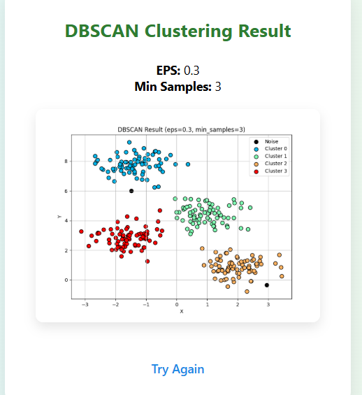
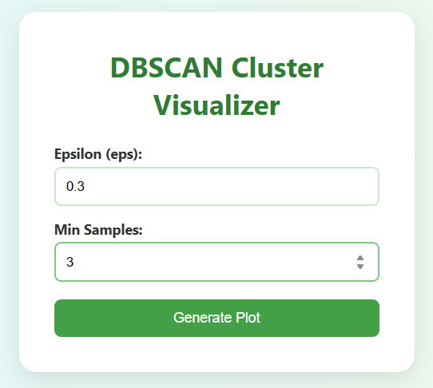

# DBSCAN  
# 🌐 DBSCAN Clustering on Blobs Dataset  

This project demonstrates **Density-Based Spatial Clustering of Applications with Noise (DBSCAN)** on a synthetic `make_blobs` dataset using scikit-learn. The output is a visualization showing how DBSCAN identifies dense regions and separates noise points.  

---

## 📌 Project Overview  

- 📊 **Dataset:** `make_blobs` – generates isotropic Gaussian blobs for clustering.  
- ⚙️ **Algorithm:** DBSCAN (Density-Based Spatial Clustering)  
- 🎯 **Goal:** Show how DBSCAN clusters dense regions and detects noise.  
- 🖼️ **Output:** A PNG image (`dbscan_result.png`) with plotted clusters and noise points.  

---

## 🧪 Parameters  

- `eps`: Maximum distance between two samples for them to be considered part of the same cluster.  
- `min_samples`: Minimum number of points required to form a dense cluster (core point).  

---

## 🔄 Workflow  

1. **Generate Data:** 300 points with 4 Gaussian blob centers and standard deviation of 0.6.  
2. **Scale Features:** Standardize using `StandardScaler` for optimal clustering performance.  
3. **Apply DBSCAN:** Cluster the standardized data using given `eps` and `min_samples`.  
4. **Visualize:**  
   - Assign a unique color to each cluster.  
   - Mark noise points (`label = -1`) in black.  
   - Save the output plot to `static/dbscan_result.png`.  

---

## 📸 Screenshot  
  
